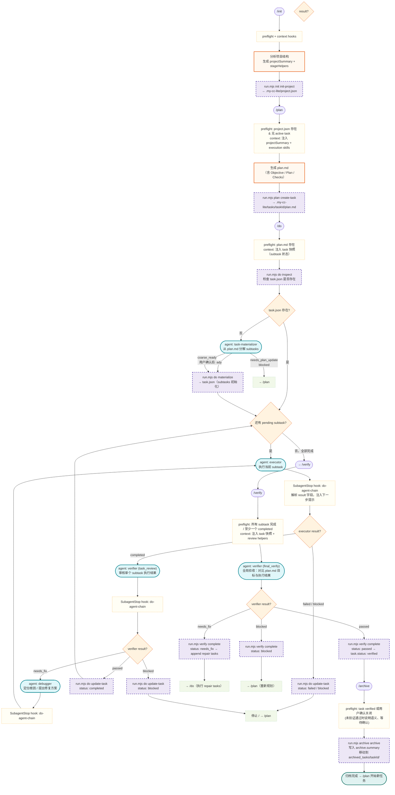

# my-cc-lite 完整执行流程（紧凑版）

## 关键约定

| 层 | 职责 |
|---|---|
| **Hooks（只读）** | `stage-preflight`：结构性检查，不通过则硬阻断；`stage-context`：注入阶段快照；`do-agent-chain`：解析 agent 输出、注入下一步提示 |
| **Agents（不写状态）** | `task-materializer` 分解 plan → subtasks；`executor` 执行；`verifier` 审核（task_review / final_verify）；`debugger` 诊断 |
| **Scripts（持久化）** | `run.mjs <stage> <action>` 是唯一写 `.my-cc-lite/` 的入口；CWD 始终为目标项目根 |
| **状态文件** | `project.json`（全局）、`tasks/<id>/plan.md`（只读参考）、`tasks/<id>/task.json`（执行状态）、`archived_tasks/<id>/`（归档） |
