# my-cc-lite 核心执行流程（简化版）

```mermaid
flowchart TD
    classDef stageBox fill:#fff8f0,stroke:#e65100,stroke-width:2px
    classDef stateWrite fill:#ede7f6,stroke:#4527a0,stroke-width:1px,stroke-dasharray: 5 5
    classDef agentBox fill:#e0f7fa,stroke:#00838f,stroke-width:2px
    classDef routeBox fill:#f8f9fa,stroke:#78909c,stroke-width:1px
    classDef doneBox fill:#e0f2f1,stroke:#00695c,stroke-width:2px
    classDef backBox fill:#f1f8e9,stroke:#a5d6a7,stroke-width:1px,stroke-dasharray: 4 3
    classDef hookNote fill:#fffef5,stroke:#f9a825,stroke-width:1px,stroke-dasharray: 3 3,font-size:11px

    subgraph INIT["INIT — 项目初始化"]
        direction TB
        INIT_HOOK["Hook: preflight/context"]:::hookNote
        INIT_ANALYZE["分析项目"]:::stageBox
        INIT_WRITE["Script: init init-project\n写 project.json"]:::stateWrite
        INIT_HOOK --> INIT_ANALYZE --> INIT_WRITE
    end

    INIT_WRITE --> PLAN_HOOK

    subgraph PLAN["PLAN — 任务计划"]
        direction TB
        PLAN_HOOK["Hook: preflight/context"]:::hookNote
        PLAN_METHOD{"计划生成方式?"}:::stageBox
        PLAN_DRAFT["收敛 plan.md"]:::stageBox
        PLAN_WRITE["Script: plan create-task\n创建 active task / 写 plan.md"]:::stateWrite
        PLAN_HOOK --> PLAN_METHOD --> PLAN_DRAFT --> PLAN_WRITE
    end

    PLAN_WRITE --> DO_HOOK

    subgraph DO["DO — 任务执行"]
        direction TB
        DO_HOOK["Hook: preflight"]:::hookNote
        DO_INSPECT["Script: do inspect"]:::stageBox
        DO_EXISTS{"task.json 存在?"}:::stageBox

        MATERIALIZER(("agent: task-materializer")):::agentBox
        MATERIALIZER_RESULT{"物化结果?"}:::stageBox
        MATERIALIZER_CONFIRM{"用户确认 coarse task?"}:::stageBox
        MATERIALIZE_WRITE["Script: do materialize\n写 task.json"]:::stateWrite
        BACK_PLAN_FROM_MATERIALIZE["needs_plan_update / blocked\n回到 /plan"]:::backBox

        TAKEOVER{"接管方式?"}:::stageBox
        EXTERNAL_WRITE["外部高阶接管\nScript: do update-task"]:::stateWrite

        EXECUTOR(("agent: executor")):::agentBox
        EXECUTOR_HOOK["Hook: do-agent-chain"]:::hookNote
        EXECUTOR_RESULT{"executor 结果?"}:::stageBox
        TASK_REVIEW(("agent: verifier\n(task_review)")):::agentBox
        REVIEW_HOOK["Hook: do-agent-chain"]:::hookNote
        REVIEW_RESULT{"verifier 结果?"}:::stageBox
        DEBUGGER(("agent: debugger")):::agentBox
        UPDATE_TASK["Script: do update-task\n写 task 状态"]:::stateWrite
        DO_BLOCKED["failed / blocked\n停止"]:::routeBox
        ALL_DONE{"全部完成?"}:::stageBox

        DO_HOOK --> DO_INSPECT --> DO_EXISTS
        DO_EXISTS -->|否| MATERIALIZER --> MATERIALIZER_RESULT
        MATERIALIZER_RESULT -->|ready| MATERIALIZE_WRITE --> TAKEOVER
        MATERIALIZER_RESULT -->|coarse_ready| MATERIALIZER_CONFIRM
        MATERIALIZER_CONFIRM -->|确认| MATERIALIZE_WRITE
        MATERIALIZER_CONFIRM -->|取消| BACK_PLAN_FROM_MATERIALIZE
        MATERIALIZER_RESULT -->|needs_plan_update / blocked| BACK_PLAN_FROM_MATERIALIZE

        DO_EXISTS -->|是| EXECUTOR
        TAKEOVER -->|原生| EXECUTOR
        TAKEOVER -->|外部| EXTERNAL_WRITE --> ALL_DONE

        EXECUTOR --> EXECUTOR_HOOK --> EXECUTOR_RESULT
        EXECUTOR_RESULT -->|completed| TASK_REVIEW --> REVIEW_HOOK --> REVIEW_RESULT
        EXECUTOR_RESULT -->|failed / blocked| UPDATE_TASK --> DO_BLOCKED

        REVIEW_RESULT -->|passed| UPDATE_TASK
        REVIEW_RESULT -->|needs_fix| DEBUGGER --> EXECUTOR
        REVIEW_RESULT -->|blocked| UPDATE_TASK --> DO_BLOCKED

        UPDATE_TASK --> ALL_DONE
        ALL_DONE -->|否| EXECUTOR
    end

    ALL_DONE -->|是| VERIFY_HOOK

    subgraph VERIFY["VERIFY — 任务验收"]
        direction TB
        VERIFY_HOOK["Hook: preflight"]:::hookNote
        FINAL_VERIFY(("agent: verifier\n(final_verify)")):::agentBox
        VERIFY_RESULT{"验收结论?"}:::stageBox
        VERIFY_PASSED["Script: verify complete\nstatus: verified"]:::doneBox
        VERIFY_REPAIR["append repair tasks\n回到 /do"]:::backBox
        VERIFY_BLOCKED["write blocked\n回到 /plan"]:::backBox

        VERIFY_HOOK --> FINAL_VERIFY --> VERIFY_RESULT
        VERIFY_RESULT -->|passed| VERIFY_PASSED
        VERIFY_RESULT -->|needs_fix| VERIFY_REPAIR
        VERIFY_RESULT -->|blocked| VERIFY_BLOCKED
    end

    VERIFY_PASSED --> ARCHIVE_HOOK

    subgraph ARCHIVE["ARCHIVE — 任务归档"]
        direction TB
        ARCHIVE_HOOK["Hook: preflight"]:::hookNote
        ARCHIVE_GATE{"verified\n或用户确认关闭?"}:::stageBox
        ARCHIVE_WRITE["Script: archive archive\n移动到 archived_tasks"]:::stateWrite
        ARCHIVE_STOP["保留 active task"]:::routeBox

        ARCHIVE_HOOK --> ARCHIVE_GATE
        ARCHIVE_GATE -->|是| ARCHIVE_WRITE
        ARCHIVE_GATE -->|否| ARCHIVE_STOP
    end

    ARCHIVE_WRITE --> NEXT_PLAN["归档完成\n新任务从 /plan 开始"]:::backBox

    style INIT fill:#f0f7ff,stroke:#90caf9
    style PLAN fill:#f1f8e9,stroke:#a5d6a7
    style DO fill:#fff8f0,stroke:#ffcc80
    style VERIFY fill:#fff0f3,stroke:#ef9a9a
    style ARCHIVE fill:#faf5fc,stroke:#ce93d8
```

## 关键约束

- `scripts/run.mjs` 是统一入口，负责从插件根目录分发阶段脚本，并保持目标项目 `cwd` 不变。
- Scripts 是唯一 `.my-cc-lite/` 状态写入者；Hooks 只做门禁、上下文注入和下一步提示，不直接写状态。
- Agents 只做判断、执行或建议，不直接写 `task.json`；`executor completed` 必须经过 `verifier(task_review)`。
- `task.json` 只在 `/do` 阶段物化；已有 `task.json` 的后续 `/do` 恢复不重新选择外部接管，只回到原生状态接管。
- `/verify needs_fix` 只能 append repair tasks，然后回到 `/do`；当前 MVP 只允许一个 active task。
- 各阶段入口默认经过 preflight/context；`/do` agent 返回后由 do-agent-chain 补充下一步提示。
