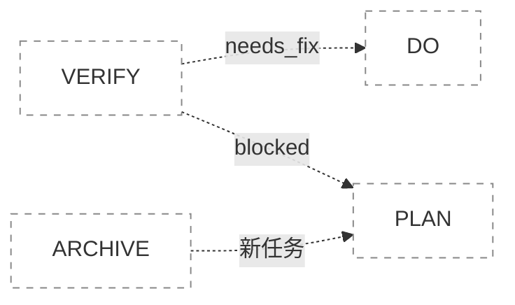
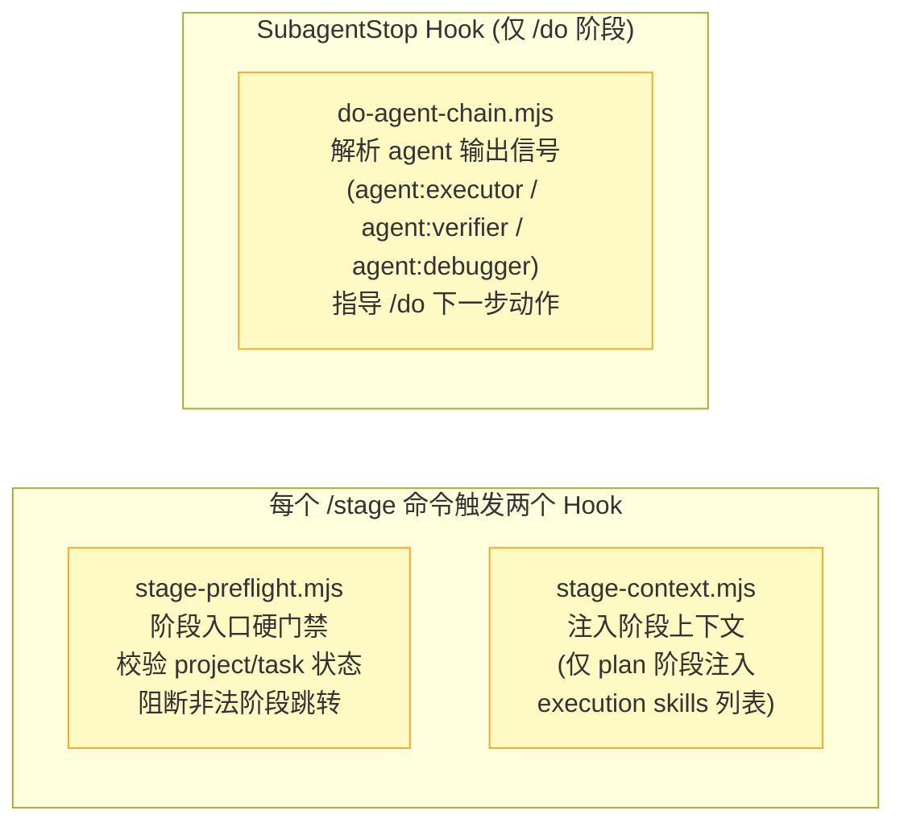
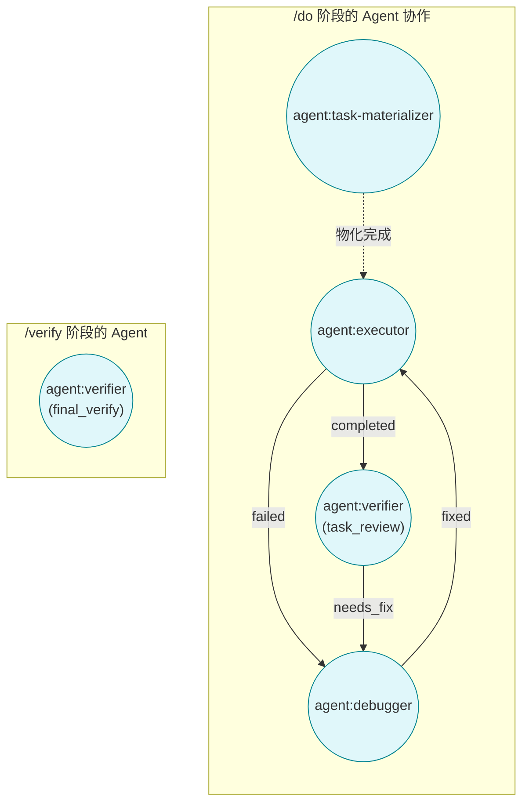
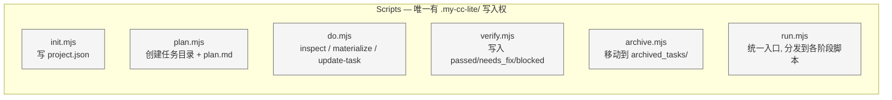

# my-cc-lite 核心执行流程

## 主流程

```mermaid
flowchart TD
    classDef initBox fill:#e3f2fd,stroke:#1565c0,stroke-width:2px
    classDef planBox fill:#e8f5e9,stroke:#2e7d32,stroke-width:2px
    classDef doBox fill:#fff3e0,stroke:#e65100,stroke-width:2px
    classDef verifyBox fill:#fce4ec,stroke:#c62828,stroke-width:2px
    classDef archiveBox fill:#f3e5f5,stroke:#6a1b9a,stroke-width:2px
    classDef stateNote fill:#ede7f6,stroke:#4527a0,stroke-width:1px,stroke-dasharray: 5 5
    classDef needsFixBox fill:#fff3e0,stroke:#ef6c00,stroke-width:2px
    classDef passedBox fill:#e0f2f1,stroke:#00695c,stroke-width:2px
    classDef blockedBox fill:#eceff1,stroke:#78909c,stroke-width:2px
    classDef backToDo fill:#fff8f0,stroke:#ffcc80,stroke-width:1px,stroke-dasharray: 4 3
    classDef backToPlan fill:#f1f8e9,stroke:#a5d6a7,stroke-width:1px,stroke-dasharray: 4 3
    classDef hookNote fill:#fffef5,stroke:#f9a825,stroke-width:1px,stroke-dasharray: 3 3,font-size:11px
    classDef agentBox fill:#e0f7fa,stroke:#00838f,stroke-width:2px

    USER((👤 用户))
    USER --> INIT

    subgraph INIT["📦 INIT — 项目初始化"]
        direction TB
        HI["Hook: stage-preflight\n检查多 active task"]:::hookNote
        I1["分析项目结构\n写出 projectSummary / stageHelpers"]:::initBox
        I2["写入 .my-cc-lite/project.json"]:::stateNote
        HI -.-> I1 --> I2
    end

    subgraph PLAN["📋 PLAN — 任务计划"]
        direction TB

        subgraph PLAN_R1[" "]
            direction LR
            HP["Hook: stage-preflight\n检查 project 初始化 + active task 冲突"]:::hookNote
            HP2["Hook: stage-context\n注入 execution skills 列表供计划参考"]:::hookNote
            P1["分析任务类型\n(small-change / bug-debug /\n feature-build / refactor-migration)"]:::planBox
            HP -.-> HP2 -.-> P1
        end

        subgraph PLAN_R2[" "]
            direction LR
            P2{"计划生成方式?"}:::planBox
            P3a(("agent:plan")):::agentBox
            P3b["my-cc-lite 原生生成"]:::planBox
            P4["收敛草案 + 质量自检\n生成 planMarkdown"]:::planBox
            P5{"通过自检?"}:::planBox
            P6["创建 tasks/&lt;taskId&gt;/\n写入 plan.md"]:::stateNote

            P2 -->|agent| P3a
            P2 -->|原生| P3b
            P3a --> P4
            P3b --> P4
            P4 --> P5
            P5 -->|是| P6
            P5 -->|否| P4
        end

        P1 --> P2
    end

    subgraph DO["⚡ DO — 任务执行"]
        direction TB
        HD["Hook: stage-preflight\n检查 task.json / plan.md / task 状态"]:::hookNote
        D1{"task.json 存在?"}:::doBox
        D2(("agent:task-materializer")):::agentBox
        D3{"物化结果?"}:::doBox
        D4["ready → 写入 task.json"]:::stateNote
        D5["needs_plan_update / blocked\n⤴ 回到 /plan"]:::backToPlan
        D6["恢复状态\n选择当前 task"]:::doBox
        D7{"接管方式?"}:::doBox
        D8["原生 task loop"]:::doBox
        D9["外部高阶接管\n(Workflow 等)"]:::doBox
        D10(("agent:executor")):::agentBox
        HA1["Hook: do-agent-chain\n解析 executor 信号"]:::hookNote
        D11{"executor 结果?"}:::doBox
        D12(("agent:verifier")):::agentBox
        HA2["Hook: do-agent-chain\n解析 verifier 信号"]:::hookNote
        D13{"verifier 复查?"}:::doBox
        D14["passed → 写入 completed"]:::stateNote
        D15(("agent:debugger")):::agentBox
        D16["failed / blocked\n→ 写入状态, 停止"]:::stateNote
        D17{"全部完成?"}:::doBox
        D18["停止 → /verify"]:::doBox

        HD -.-> D1
        D1 -->|否| D2
        D1 -->|是| D6
        D2 --> D3
        D3 -->|ready| D4
        D3 -->|needs_plan_update| D5
        D4 --> D7
        D6 --> D8
        D7 -->|原生| D8
        D7 -->|外部| D9
        D8 --> D10 --> HA1 -.-> D11
        D11 -->|completed| D12
        D11 -->|failed| D16
        D11 -->|blocked| D16
        D12 --> HA2 -.-> D13
        D13 -->|passed| D14
        D13 -->|needs_fix| D15
        D13 -->|blocked| D16
        D15 --> D10
        D9 --> D17
        D14 --> D17
        D17 -->|是| D18
        D17 -->|否| D10
    end

    subgraph VERIFY["✅ VERIFY — 任务验收"]
        direction TB
        HV["Hook: stage-preflight\n检查 task.json / 未完成任务"]:::hookNote
        V1(("agent:verifier(final_verify)")):::agentBox
        V2{"结论?"}:::verifyBox

        HV -.-> V1
        V1 --> V2

        subgraph V_OUTCOMES[" "]
            direction TB
            V4["🔧 needs_fix\n追加 repair tasks\n⤴ 回到 /do"]:::backToDo
            V3["✅ passed\nstatus: verified\n↓ /archive"]:::passedBox
            V5["🚫 blocked\nstatus: blocked\n⤴ 回到 /plan"]:::backToPlan
        end

        V2 -->|needs_fix| V4
        V2 -->|passed| V3
        V2 -->|blocked| V5
    end

    subgraph ARCHIVE["📁 ARCHIVE — 任务归档"]
        direction TB
        HA["Hook: stage-preflight\n检查 task.json / 归档目标冲突"]:::hookNote
        A1["确认归档语义\n(根据 verification.status)"]:::archiveBox
        A2{"验证通过?"}:::archiveBox
        A3["常规归档"]:::archiveBox
        A4{"用户明确关闭?"}:::archiveBox
        A5["确认风险\n(关闭 ≠ 完成)"]:::archiveBox
        A6["写入 archive.summary\n移动 tasks/ → archived_tasks/\n⤴ 新任务 → /plan"]:::backToPlan
        HA -.-> A1
        A1 --> A2
        A2 -->|passed| A3
        A2 -->|未通过| A4
        A4 -->|是| A6
        A4 -->|否| A5
        A5 --> A6
        A3 --> A6
    end

    %% 正向流程
    INIT --> PLAN
    PLAN --> DO
    DO --> VERIFY
    VERIFY -->|passed| ARCHIVE

    %% 阶段底色
    style INIT fill:#f0f7ff,stroke:#90caf9
    style PLAN fill:#f1f8e9,stroke:#a5d6a7
    style DO fill:#fff8f0,stroke:#ffcc80
    style VERIFY fill:#fff0f3,stroke:#ef9a9a
    style ARCHIVE fill:#faf5fc,stroke:#ce93d8
    style V_OUTCOMES fill:#fff0f3,stroke:none
    style PLAN_R1 fill:none,stroke:none
    style PLAN_R2 fill:none,stroke:none
```

**阶段回退路径：**

## Hooks 调用链

## Agents 调用链

## Scripts 状态层

## 架构概要

| 层级                | 组成                                                                               | 职责                                     |
| ------------------- | ---------------------------------------------------------------------------------- | ---------------------------------------- |
| **Skills** (5个)    | `init/plan/do/verify/archive`                                                      | 阶段入口，定义提示词、操作步骤、禁止事项 |
| **Hooks** (3个脚本) | `stage-preflight` / `stage-context` / `do-agent-chain`                             | 阶段门禁、上下文注入、agent 信号解析     |
| **Agents** (4个)    | `agent:task-materializer` / `agent:executor` / `agent:verifier` / `agent:debugger` | 可委派的专门判断/执行，只返回建议不落盘  |
| **Scripts** (6个)   | `init/plan/do/verify/archive/run.mjs` + `lib/`                                     | 确定性状态读写，唯一写入者               |

## 关键设计约束

- **Scripts 是唯一状态写入者** — Agents 和 Hooks 不直接写 `task.json`/`project.json`
- **每个阶段只沉淀当前阶段信息** — plan 不写 task.json，do 不写 verification
- **单一路径** — MVP 只允许一个 active task，preflight hook 阻断非法跳转
- **状态本地可读** — `.my-cc-lite/` 下纯 JSON + Markdown，方便人工接管
