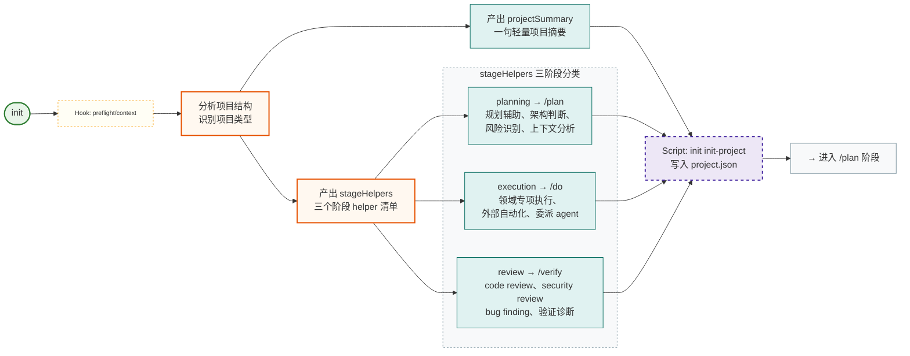
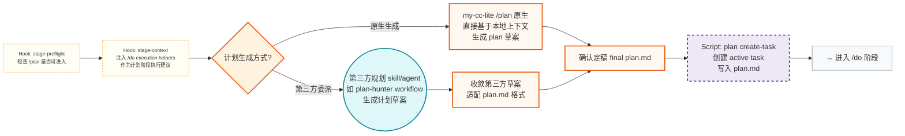
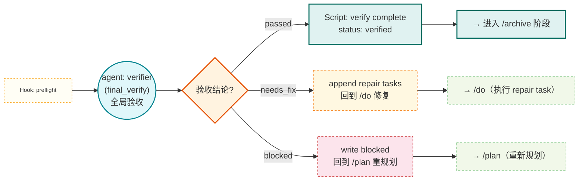
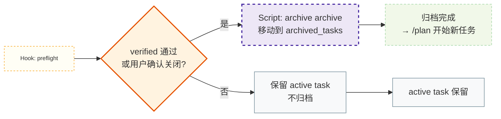
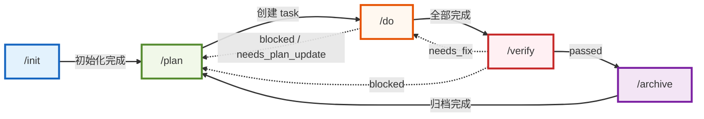

# my-cc-lite 各阶段执行流程（分阶段展开）

> 每个阶段独立 mermaid 图，便于聚焦细读。

---

## 1. INIT — 项目初始化

---

## 2. PLAN — 任务计划

---

## 3. DO — 任务执行

```mermaid
flowchart LR
    classDef stageBox fill:#fff8f0,stroke:#e65100,stroke-width:2px
    classDef stateWrite fill:#ede7f6,stroke:#4527a0,stroke-width:2px,stroke-dasharray: 5 5
    classDef agentBox fill:#e0f7fa,stroke:#00838f,stroke-width:2px
    classDef routeBox fill:#f8f9fa,stroke:#78909c,stroke-width:1px
    classDef doneBox fill:#e0f2f1,stroke:#00695c,stroke-width:2px
    classDef backBox fill:#f1f8e9,stroke:#a5d6a7,stroke-width:1px,stroke-dasharray: 4 3
    classDef hookNote fill:#fffef5,stroke:#f9a825,stroke-width:1px,stroke-dasharray: 3 3,font-size:11px
    classDef decisionBox fill:#fff3e0,stroke:#e65100,stroke-width:2px

    subgraph PHASE_A["阶段 A — 检查与物化"]
        DO_HOOK["Hook: preflight"]:::hookNote
        DO_INSPECT["Script: do inspect\n检查当前状态"]:::stageBox
        DO_EXISTS{"task.json 存在?\n（已有物化任务？）"}:::decisionBox

        DO_HOOK --> DO_INSPECT --> DO_EXISTS

        MATERIALIZER(("agent: task-materializer\n从 plan.md 物化 coarse task")):::agentBox
        MATERIALIZER_RESULT{"物化结果?"}:::decisionBox
        MATERIALIZER_CONFIRM{"用户确认\ncoarse task?"}:::decisionBox
        MATERIALIZE_WRITE["Script: do materialize\n写入 task.json"]:::stateWrite
        BACK_TO_PLAN["回到 /plan\nneeds_plan_update / blocked"]:::backBox

        DO_EXISTS -->|否| MATERIALIZER --> MATERIALIZER_RESULT
        MATERIALIZER_RESULT -->|ready| MATERIALIZE_WRITE
        MATERIALIZER_RESULT -->|coarse_ready| MATERIALIZER_CONFIRM
        MATERIALIZER_CONFIRM -->|确认| MATERIALIZE_WRITE
        MATERIALIZER_CONFIRM -->|取消| BACK_TO_PLAN
        MATERIALIZER_RESULT -->|needs_plan_update / blocked| BACK_TO_PLAN
    end

    subgraph PHASE_B["阶段 B — 接管与执行"]
        TAKEOVER{"接管方式?"}:::decisionBox
        TAKEOVER -->|原生接管| EXECUTOR

        EXTERNAL_WRITE["外部高阶接管\nScript: do update-task"]:::stateWrite

        TAKEOVER -->|外部接管| EXTERNAL_WRITE --> CHECK_ALL_DONE_B

        EXECUTOR(("agent: executor\n执行具体 task")):::agentBox
        EXECUTOR_HOOK["Hook: do-agent-chain"]:::hookNote
        EXECUTOR_RESULT{"executor 结果?"}:::decisionBox

        MATERIALIZE_WRITE --> TAKEOVER
        DO_EXISTS --->|是| TAKEOVER
        EXECUTOR --> EXECUTOR_HOOK --> EXECUTOR_RESULT
    end

    subgraph PHASE_C["阶段 C — 审核与调试"]
        TASK_REVIEW(("agent: verifier\n(task_review)\n审核执行结果")):::agentBox
        REVIEW_HOOK["Hook: do-agent-chain"]:::hookNote
        REVIEW_RESULT{"verifier 结果?"}:::decisionBox
        DEBUGGER(("agent: debugger\n定位失败根因")):::agentBox

        EXECUTOR_RESULT -->|completed| TASK_REVIEW --> REVIEW_HOOK --> REVIEW_RESULT
        EXECUTOR_RESULT -->|failed / blocked| UPDATE_TASK_FAIL

        REVIEW_RESULT -->|passed| UPDATE_TASK_PASS
        REVIEW_RESULT -->|needs_fix| DEBUGGER --> EXECUTOR
        REVIEW_RESULT -->|blocked| UPDATE_TASK_BLOCKED

        UPDATE_TASK_PASS["Script: do update-task\nstatus: completed"]:::stateWrite
        UPDATE_TASK_FAIL["Script: do update-task\nstatus: failed/blocked"]:::stateWrite
        UPDATE_TASK_BLOCKED["Script: do update-task\nstatus: blocked"]:::stateWrite

        UPDATE_TASK_PASS --> CHECK_ALL_DONE_C
        UPDATE_TASK_FAIL --> DO_BLOCKED
        UPDATE_TASK_BLOCKED --> DO_BLOCKED

        DO_BLOCKED["停止执行"]:::doneBox
    end

    DO_BLOCKED --> BACK_PLAN_DO["→ /plan"]:::backBox

    CHECK_ALL_DONE_B{"全部 task 完成?"}:::decisionBox
    CHECK_ALL_DONE_C{"全部 task 完成?"}:::decisionBox

    EXTERNAL_WRITE --> CHECK_ALL_DONE_B
    CHECK_ALL_DONE_B -->|否| EXECUTOR
    CHECK_ALL_DONE_B -->|是| TO_VERIFY

    UPDATE_TASK_PASS --> CHECK_ALL_DONE_C
    CHECK_ALL_DONE_C -->|否| EXECUTOR
    CHECK_ALL_DONE_C -->|是| TO_VERIFY

    TO_VERIFY["→ 进入 /verify 阶段"]:::routeBox

    style PHASE_A fill:#f0f7ff,stroke:#90caf9
    style PHASE_B fill:#fff8f0,stroke:#ffcc80
    style PHASE_C fill:#fff0f3,stroke:#ef9a9a
```

---

## 4. VERIFY — 任务验收

---

## 5. ARCHIVE — 任务归档

---

## 阶段间流转总览

